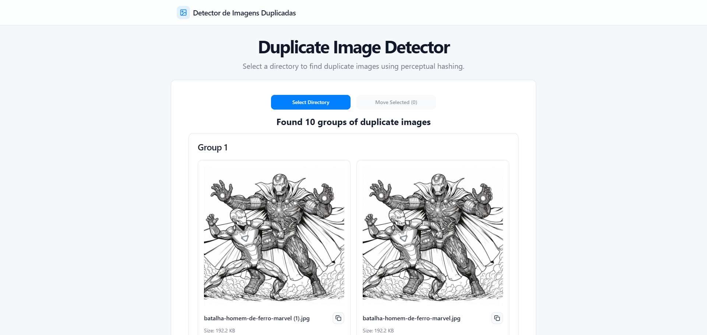

# 🖼 duplicate-image-detector



## ⭐ Visão Geral

Esta aplicação foi criada 100% por IA, utilizando [lovable.dev](https://lovable.dev) e Cursor AI. Seu objetivo é identificar e remover imagens duplicadas, facilitando o gerenciamento e upload de imagens para meu site [Mundo Colorir Desenhos](https://mundocolorirdesenhos.com.br/).

## 👟 Como Rodar a Aplicação:

```sh
# Passo 1: Instale as dependências
npm install

# Passo 2: Inicie o servidor de desenvolvimento
npm run dev
```

#### Requisitos mínimos:

- Node.js & npm instalados

## 📒 Tecnologias Utilizadas

Este projeto foi desenvolvido utilizando:

- Vite
- TypeScript
- React
- shadcn-ui
- Tailwind CSS
